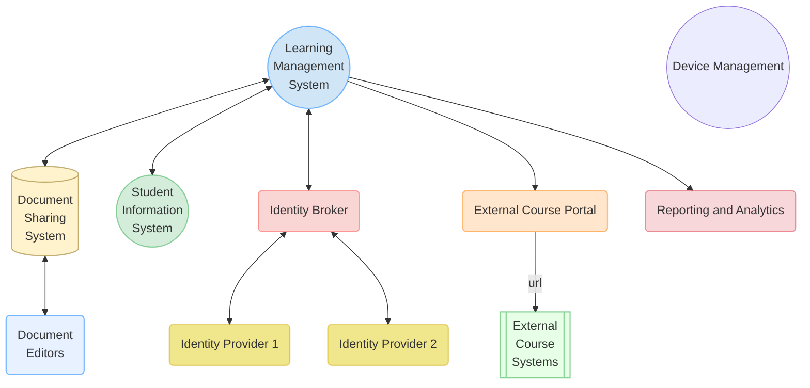

```mermaid
flowchart
    LMS((Learning<br>Management<br>System)):::lms
    ID(Identity Broker):::id
    IDP1(Identity Provider 1):::idp
    IDP2(Identity Provider 2):::idp
    SIS((Student<br>Information<br>System)):::sis
    DOC[(Document<br>Sharing<br>System)]:::doc
    ED(Document<br>Editors):::ed
    EXT[[External<br>Course<br>Systems]]:::ext
    PORT(External Course Portal):::port
    REP(Reporting and Analytics):::rep
    MDM((Device Management))

    LMS-->REP
    LMS<-->DOC<-->ED
    LMS<-->ID<-->IDP1 & IDP2
    LMS<-->SIS
    LMS-->PORT-->|url|EXT
    MDM~~~REP

%% The section below defines the styling for the nodes
    classDef lms fill:#d0e6f6,stroke:#007bff,stroke-opacity:0.5,stroke-width:1.5px, color:#333;
    classDef id fill:#f9d5d3,stroke:#ff4c4c,stroke-opacity:0.5,stroke-width:1.5px, color:#333;
    classDef idp fill:#f0e68c,stroke:#d1a800,stroke-opacity:0.5,stroke-width:1.5px, color:#333;
    classDef sis fill:#d4edda,stroke:#28a745,stroke-opacity:0.5,stroke-width:1.5px, color:#333;
    classDef doc fill:#fff3cd,stroke:#856404,stroke-opacity:0.5,stroke-width:1.5px, color:#333;
    classDef ed fill:#e7f1ff,stroke:#007bff,stroke-opacity:0.5,stroke-width:1.5px, color:#333;
    classDef ext fill:#e6ffe6,stroke:#28a745,stroke-opacity:0.5,stroke-width:1.5px, color:#333;
    classDef port fill:#ffe6cc,stroke:#ff7e00,stroke-opacity:0.5,stroke-width:1.5px, color:#333;
    classDef rep fill:#f8d7da,stroke:#dc3545,stroke-opacity:0.5,stroke-width:1.5px, color:#333;

```
