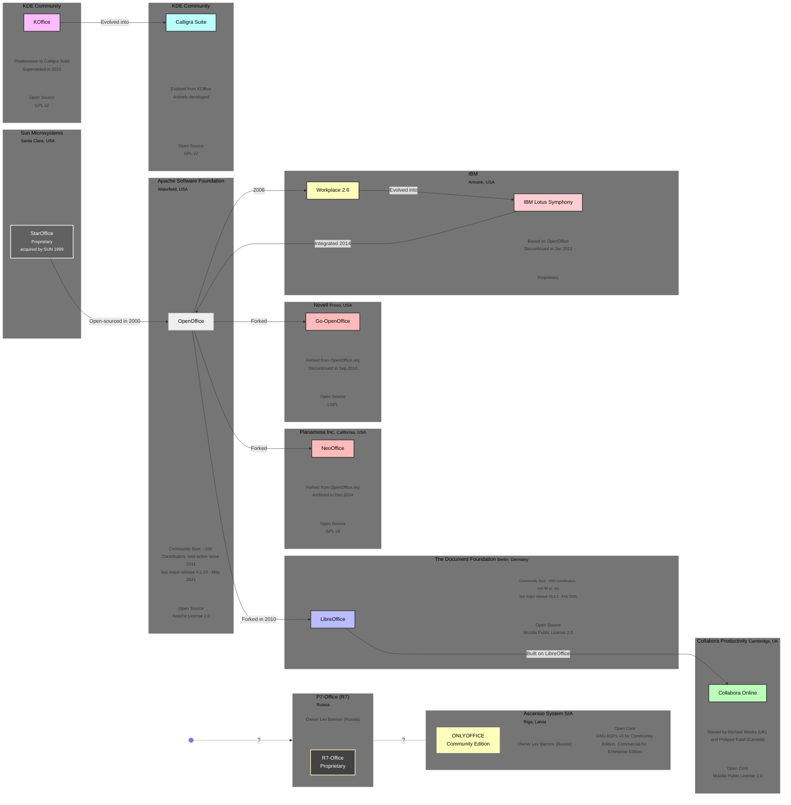

```mermaid

flowchart LR
 subgraph subGraph0["The Document Foundation <small>Berlin, Germany</small>"]
        B["LibreOffice"]
        BDetails["<br><small><small>Community Size: ~400 contributors, min 50 pr. mo<br>last major release 25.2.1 - Feb 2025</small></small>"]
        BLicense["<small>Open Source<br>Mozilla Public License 2.0</small>"]
  end
 subgraph subGraph1["Collabora Productivity <small>Cambridge, UK</small>"]
        C["Collabora Online"]
        CDetails["<br><small>Owned by Michael Meeks (UK) and Philippe Kalaf (Canada)</small>"]
        CLicense["<small>Open Core<br>Mozilla Public License 2.0</small>"]
  end
 subgraph subGraph2["Ascensio System SIA<br><small>Riga, Latvia</small>"]
        D["ONLYOFFICE<br>Community Edition"]
        DDetails["<small><br>Owner Lev Bannov (Russia)</small>"]
        DLicense["<small>Open Core<br>GNU AGPL v3 for Community Edition, Commercial for Enterprise Edition</small>"]
  end
 subgraph subGraph3["Apache Software Foundation<br><small>Wakefield, USA</small>"]
        A["OpenOffice"]
        ADetails["<br><small>Community Size: ~100 Contributors, less active since 2011<br>last major release 4.1.10 - May 2021</small>"]
        ALicense["<small>Open Source<br>Apache License 2.0</small>"]
  end
 subgraph s1["Sun Microsystems<br><small>Santa Clara, USA</small>"]
        n1["StarOffice<br><small>Proprietary<br>acquired by SUN 1999</small>"]
  end
 subgraph s3["P7-Office (R7)<small><br>Russia</small>"]
        n3["R7-Office<br>Proprietary"]
        n4["<small><br>Owner Lev Bannov (Russia)</small>"]
  end
 subgraph subGraph4["Planamesa Inc. <small>California, USA</small>"]
        E["NeoOffice"]
        EDetails["<br><small>Forked from OpenOffice.org<br>Archived in Dec 2024</small>"]
        ELicense["<small>Open Source<br>GPL v3</small>"]
  end
 subgraph subGraph5["KDE Community"]
        F["Calligra Suite"]
        FDetails["<br><small>Evolved from KOffice<br>Actively developed</small>"]
        FLicense["<small>Open Source<br>GPL v2</small>"]
  end
 subgraph subGraph6["KDE Community"]
        G["KOffice"]
        GDetails["<br><small>Predecessor to Calligra Suite<br>Superseded in 2010</small>"]
        GLicense["<small>Open Source<br>GPL v2</small>"]
  end
 subgraph subGraph7["Novell <small>Provo, USA</small>"]
        H["Go-OpenOffice"]
        HDetails["<br><small>Forked from OpenOffice.org<br>Discontinued in Sep 2010</small>"]
        HLicense["<small>Open Source<br>LGPL</small>"]
  end
 subgraph subGraph8["IBM<br><small>Armonk, USA</small>"]
        I["IBM Lotus Symphony"]
        IDetails["<br><small>Based on OpenOffice<br>Discontinued in Jan 2012</small>"]
        J["Workplace 2.6"]
        JLicense["<small>Proprietary</small>"]
  end
    n1 -- "Open-sourced in 2000" --> A
    A -- Forked in 2010 --> B
    B -- Built on LibreOffice ---> C
    A -- Forked --> E & H
    G -- Evolved into --> F
    J -- Evolved into --> I
    A -- 2006 --> J
    I -- Integrated 2014 --> A
    s1 ~~~ FLicense
    subGraph2 ~~~ subGraph1
    s3 -. ? .- subGraph2
    B ~~~ BDetails
    n4 ~~~ n3
    n5["Untitled Node"] -. ? .-> s3
    BDetails@{ shape: text}
    BLicense@{ shape: text}
    CDetails@{ shape: text}
    CLicense@{ shape: text}
    DDetails@{ shape: text}
    DLicense@{ shape: text}
    ADetails@{ shape: text}
    ALicense@{ shape: text}
    n3@{ shape: rect}
    n4@{ shape: text}
    EDetails@{ shape: text}
    ELicense@{ shape: text}
    FDetails@{ shape: text}
    FLicense@{ shape: text}
    GDetails@{ shape: text}
    GLicense@{ shape: text}
    HDetails@{ shape: text}
    HLicense@{ shape: text}
    IDetails@{ shape: text}
    JLicense@{ shape: text}
    n5@{ shape: f-circ}
     B:::libreOffice
     C:::collabora
     D:::onlyOffice
     A:::openOffice
     A:::Ash
     n1:::Ash
     n1:::openOffice
     n3:::onlyOffice
     E:::neoOffice
     F:::calligraSuite
     G:::kOffice
     H:::goOpenOffice
     I:::ibmSymphony
     J:::workplace
    classDef libreOffice fill:#bbf,stroke:#333,stroke-width:2px,color:#000
    classDef collabora fill:#bfb,stroke:#333,stroke-width:2px,color:#000
    classDef onlyOffice fill:#ffb,stroke:#333,stroke-width:2px,color:#000
    classDef neoOffice fill:#fbb,stroke:#333,stroke-width:2px,color:#000
    classDef calligraSuite fill:#bff,stroke:#333,stroke-width:2px,color:#000
    classDef kOffice fill:#fbf,stroke:#333,stroke-width:2px,color:#000
    classDef goOpenOffice fill:#fbb,stroke:#333,stroke-width:2px,color:#000
    classDef ibmSymphony fill:#bfb,stroke:#333,stroke-width:2px,color:#000
    classDef workplace fill:#ffb,stroke:#333,stroke-width:2px,color:#000
    classDef Sky stroke-width:1px, stroke-dasharray:none, stroke:#374D7C, fill:#E2EBFF, color:#374D7C
    classDef Peach stroke-width:1px, stroke-dasharray:none, stroke:#FBB35A, fill:#FFEFDB, color:#8F632D
    classDef Ash stroke-width:1px, stroke-dasharray:none, stroke:#999999, fill:#EEEEEE, color:#000
    classDef openOffice fill:#f9f, stroke:#333, stroke-width:2px,color:#000
    style D stroke:#FFF9C4,color:#000
    style n1 stroke:#FFFFFF,fill:#616161,color:#FFFFFF
    style n3 stroke:#FFF9C4,fill:#424242,color:#FFFFFF
    style I fill:#FFCDD2,color:#000
    style s1 stroke:#FFFFFF,color:#000,fill:#757575
    style subGraph2 stroke:#FFFFFF,color:#000,fill:#757575
    style subGraph1 stroke:#FFFFFF,color:#000,fill:#757575
    style s3 stroke:#FFFFFF,color:#000,fill:#757575
    style subGraph0 stroke:#FFFFFF,color:#000,fill:#757575
    style subGraph6 stroke:#FFFFFF,color:#000,fill:#757575
    style subGraph3 stroke:#FFFFFF,color:#000,fill:#757575
    style subGraph4 stroke:#FFFFFF,color:#000,fill:#757575
    style subGraph5 stroke:#FFFFFF,color:#000,fill:#757575
    style subGraph7 stroke:#FFFFFF,color:#000,fill:#757575
    style subGraph8 stroke:#FFFFFF,color:#000,fill:#757575

```
