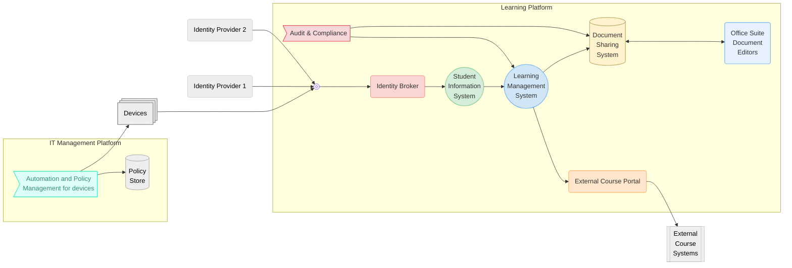

# Solution Landscape

```mermaid
flowchart LR
 subgraph s1["Learning Platform"]
        LMS(("Learning<br>Management<br>System"))
        DOC[("Document<br>Sharing<br>System")]
        ID("Identity Broker")
        ED("Office Suite<br>Document<br>Editors")
        SIS(("Student<br>Information<br>System"))
        PORT("External Course Portal")
        REP>"Audit &amp; Compliance"]
        n5["Frames Circle"]
  end
 subgraph s2["IT Management Platform"]
        n3>"Automation and Policy<br>Management for devices"]
        n4["Policy<br>Store"]
  end
    PORT --> EXT[["External<br>Course<br>Systems"]]
    LMS --> DOC & PORT
    DOC <--> ED
    SIS --> LMS
    EXT ~~~ ED
    ID --> SIS
    IDP2("Identity Provider 2") --> n5
    REP --> DOC
    REP ----> LMS
    Device["Devices"] ---> n5
    n3 --> Device & n4
    s2 ~~~ s1
    n5 --> ID
    IDP1("Identity Provider 1") --> n5
    n5@{ shape: fr-circ}
    n4@{ shape: cyl}
    Device@{ shape: procs}
     LMS:::lms
     DOC:::doc
     ID:::id
     ED:::ed
     SIS:::sis
     PORT:::port
     REP:::rep
     n3:::Aqua
     n4:::Ash
     EXT:::ext
     EXT:::Ash
     IDP2:::idp
     IDP2:::Ash
     Device:::Ash
     IDP1:::idp
     IDP1:::Ash
    
    classDef lms fill:#d0e6f6,stroke:#007bff,stroke-opacity:0.5,stroke-width:1.5px, color:#333
    classDef id fill:#f9d5d3,stroke:#ff4c4c,stroke-opacity:0.5,stroke-width:1.5px, color:#333
    classDef idp fill:#f0e68c,stroke:#d1a800,stroke-opacity:0.5,stroke-width:1.5px, color:#333
    classDef sis fill:#d4edda,stroke:#28a745,stroke-opacity:0.5,stroke-width:1.5px, color:#333
    classDef doc fill:#fff3cd,stroke:#856404,stroke-opacity:0.5,stroke-width:1.5px, color:#333
    classDef ed fill:#e7f1ff,stroke:#007bff,stroke-opacity:0.5,stroke-width:1.5px, color:#333
    classDef ext fill:#e6ffe6,stroke:#28a745,stroke-opacity:0.5,stroke-width:1.5px, color:#333
    classDef port fill:#ffe6cc,stroke:#ff7e00,stroke-opacity:0.5,stroke-width:1.5px, color:#333
    classDef rep fill:#f8d7da,stroke:#dc3545,stroke-opacity:0.5,stroke-width:1.5px, color:#333
    classDef Rose stroke-width:1px, stroke-dasharray:none, stroke:#FF5978, fill:#FFDFE5, color:#8E2236
    classDef Aqua stroke-width:1px, stroke-dasharray:none, stroke:#46EDC8, fill:#DEFFF8, color:#378E7A
    classDef Ash stroke-width:1px, stroke-dasharray:none, stroke:#999999, fill:#EEEEEE, color:#000000
```
