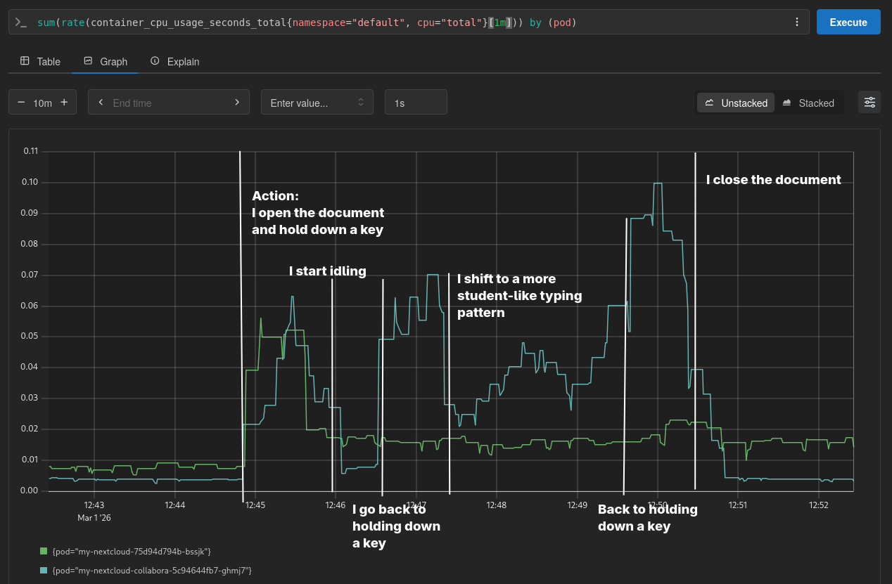
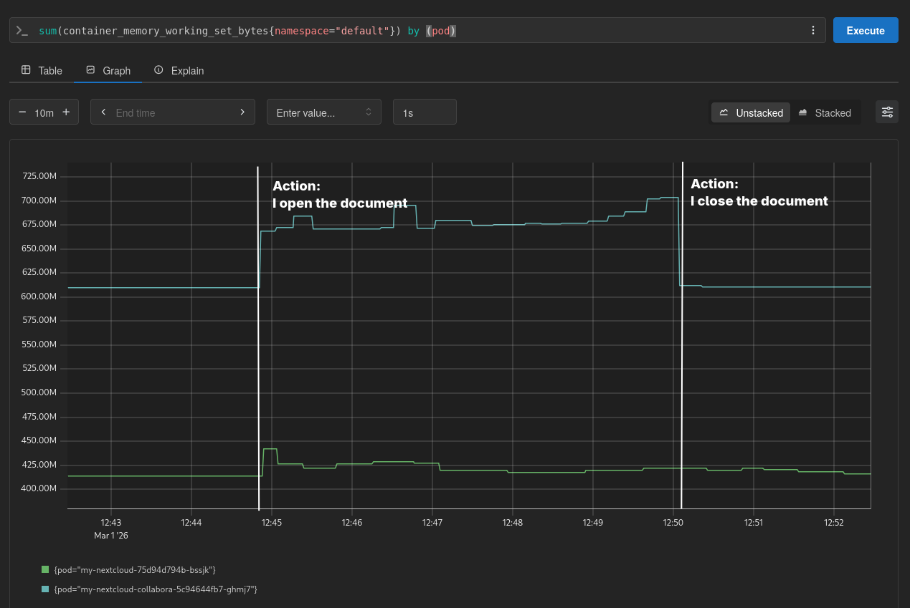

# Elasticity: Ensuring the System Can Handle High-Load Situations

**Date:** Mar 1, 2026, **Author:** [@0xf1e](https://github.com/0xf1e)  

A summary of suggestions is available at the [bottom of this document](#4-summary-suggestions-and-open-questions).

## 1. The Challenge

A digital platform for schools needs to handle situations where hundreds or thousands of students use it at the same time. Designing for this is the problem of *elasticity*: how do we build a system that scales with demand, handles traffic spikes gracefully, and recovers from unexpected failure?

A school platform faces demand that is tied to the rhythm of the school day, the school year, and specific events. The following scenarios are ones I have identified so far, though this is not an exhaustive list:

**Exams.** In the eighth and ninth grades, Danish elementary schools have a structured exam season — for example, in 2025 there was a winter exam period from December 1 to December 9.[^1] If students take exams on the same platform they use day-to-day, this creates a predictable but significant spike. Based on my technical analysis (see Chapter 2), the main challenge is not so much the start and end of the exam, but the sustained load: a high number of students actively using the system at the same time, each maintaining an ongoing connection.

**Rarely used applications that suddenly spike.** Consider an application that normally handles 1% of total platform traffic. If a new curriculum requirement causes usage to triple overnight, that component now needs to serve 3% of traffic — a 300% increase. A system that is not designed to scale individual components independently will struggle to respond to this kind of demand.

**End-of-day bulk uploads.** Picture the evening before the new school year begins, with teachers across the country uploading course materials. This is worth keeping an eye on, but it does not appear to be a high-priority concern. There are far fewer teachers than students, which limits the absolute volume of traffic. There might be pressure around specific moments — early morning on the first day of school, for instance — but overall, we mostly need to ensure that the document upload path does not become a bottleneck under moderate concurrent use.

**The start and end of the school day.** A reasonable worry is that all students across a municipality try to open the platform at the same time when lessons begin, creating a sharp spike. In practice, however, the start of lessons and the school day are staggered across schools (municipalities allow schools to set their own timetables as long as the school day falls between 8:00 and 16:00[^2]). On top of that, teachers do not tend to launch software at the exact moment a lesson begins. For now, this does not seem to be a major concern.

**Collaborative seasons.** Certain periods of the school year may involve more group work than others — project weeks, themed teaching units, and similar formats. I hypothesise that collaborative editing is more demanding than solo work, because it requires continuous data exchange between clients and servers rather than occasional saves. However, it appears that these thematic weeks fall at different times of the year for different schools. This would be more of an issue for a small municipality self-hosting with only a handful of schools. For a larger deployment like what we are looking at, usage should even out.

We can make educated guesses about these patterns, but the actual shape of real-world demand will surprise us. The goal of this document is to describe the technical characteristics of our platform under load and to propose how we should approach this technical challenge.

---
## 2. Technical Analysis: What I Observed

To understand how the system behaves under load, I set up a sample environment running Nextcloud and Collabora — an open-source file platform and its accompanying browser-based office suite. I chose this combination because it exercises the parts of the system that would be under the most pressure during an exam: file access, document editing, and the network communication between the two. I looked at network behaviour, resource consumption, and how the system responds when components fail.

### 2.1 Network Behaviour

Opening a document in Collabora triggers several HTTP requests between the browser, Nextcloud, and Collabora. One of these requests upgrades the connection to a WebSocket — a persistent, two-way channel that stays open for the duration of the editing session. When a user idles for an extended period, the WebSocket connection closes; it re-establishes automatically when the user starts interacting again.

Separately — and independently of Collabora — the browser sends a request to a Nextcloud `/sync` endpoint approximately once per second. This polling continues as long as the user has Nextcloud open in their browser, whether or not a document is being edited.

From what I have observed, the baseline network cost per connected user seems to consist of a steady stream of sync requests from Nextcloud, plus a persistent WebSocket connection for each active editing session.

### 2.2 CPU and RAM Consumption

The following measurements were taken while a document was open and being edited in Collabora.

**CPU usage:**

I observed a brief CPU spike from Nextcloud when the document was opened, though this may have been a spurious, unrelated event rather than a consistent pattern. After that, Nextcloud settled at slightly under 0.02 vCPU — up from roughly 0.01 vCPU when no document was open. Interestingly, Nextcloud's CPU usage remained at this elevated level even after the document was closed.

Collabora's CPU usage was more variable and closely tied to the rate of input. While emulating realistic student typing, Collabora sat at approximately 0.035 vCPU, with brief spikes up to 0.1 vCPU during bursts of rapid input. When closed, Collabora's baseline was just 0.003 vCPU. This suggests that Collabora's compute cost scales with the rate of changes being processed, rather than simply the number of open documents.

**RAM usage:**

Both Nextcloud and Collabora increase their RAM usage when a document is open. In my measurements, Collabora's RAM footprint grew by approximately 50 MB during an editing session, while Nextcloud's grew by approximately 10 MB. In my testing, RAM usage appeared to stabilise once the document was open — it did not continue climbing over the duration of the session.

### 2.3 Failure Behaviour

I also tested what happens when individual components go down while a user is actively editing.

**If Collabora goes down:** the editor freezes and displays a "reconnecting" message. Editing resumes once the connection is restored, and no data is lost — provided the reconnection succeeds. During an exam, however, even a temporary freeze is a serious problem: students would lose working time, which is not acceptable in a timed setting.

**If Nextcloud goes down briefly:** the user notices nothing. Editing continues normally. When the user closes the document, the file saves correctly — as long as Nextcloud is reachable again at that point.

**If Nextcloud goes down and does not recover before the file is closed:** this is a critical scenario. My tests indicated that work done after the loss of the Nextcloud connection is silently lost, with no visible warning to the user. This does not require a prolonged outage — if Nextcloud becomes unreachable at any point during an editing session and has not recovered by the time the student closes the document, the work from that period is gone.

## 3. How We Can Approach the Challenge

The following suggestions are informed by current best practices in site reliability engineering, particularly Google's SRE literature.[^sre]

### 3.1 Start with User Expectations

We do not yet have a complete picture of what students and teachers expect from the platform. This matters: we do not need to achieve maximum availability in all parts of the system, at all times. The right target is the level of reliability that matches what users actually need — and that level will differ depending on the feature and the context.

Some distinctions are worth drawing early. Users will not tolerate a one-second delay when pressing a button to bold text. But they will likely accept a short delay before a collaborator's edits appear on their screen. These are different types of interaction with different tolerance thresholds.

Similarly, in a high-load scenario such as an exam, users may accept significant delays — a queue, a spinner, a message telling them their work is being saved — as long as they receive clear communication and confidence that nothing will be lost. I assume that the absence of communication is actually the deeper problem; the delay itself is often manageable. But this is exactly the kind of assumption we should validate with real users rather than take for granted.

This means that user feedback needs to be part of our development process from early on, not just during final acceptance testing. How we plan to incorporate this feedback into our agile workflow is described in our [Iterative Development Strategy](../people_and_processes/iterative_development.md).

### 3.2 Architectural Choices That Help

Several properties of the proposed architecture that is laid out in this documentation are well suited to addressing the elasticity challenge.

**Microservice isolation.** Rather than building a single monolithic application, we are building services that communicate through well-defined interfaces. The practical benefit, if implemented well, is that a failure or overload in one service should not bring down the others. For example, if the office editing suite becomes unavailable, the file storage and management features remain functional. Students can still access their files — they simply cannot open them for editing until the service recovers.

**Independent scaling.** A microservice architecture opens the possibility of scaling individual components independently — for instance, allocating more resources to document editing during an exam without touching other services.

**Load shedding.** Consider what happens at the start of an exam, when every student tries to open their document simultaneously. Without load management, this surge of requests hits the server all at once, creates a bottleneck, and may cause the system to return errors. Students who receive errors often respond by refreshing the page or clicking again — which makes the congestion worse.

Our architecture choices make it straightforward to implement load shedding, should we choose to do so. If we did, it would work roughly like this: when a student's request arrives during peak load, the system would not process it immediately, but would queue it and retry automatically, communicating clearly that the action is in progress. The student would experience a brief delay rather than a failure. During an exam, a short wait with a clear status message is far preferable to an error with no explanation.

**Eliminating single points of failure.** Distributing services across infrastructure helps with load, but it introduces a different risk: any shared component that all services depend on becomes a single point of failure. Even if every individual application service is healthy, a failure in a shared component can halt everything.

Two examples illustrate how we might address this:

- *Routers and load balancers.* If a single router or load balancer goes down, it can cut off access to all services behind it. One way to handle this is to use virtual IPs rather than static IP-based load balancing. Virtual IPs can be reassigned quickly if a node fails, allowing traffic to reroute without manual intervention.

- *Identity and access management (IAM).* If every service makes a real-time request to a central IAM system each time a user performs an action, then the IAM system becomes a bottleneck and a single point of failure. A potential mitigation: For high-traffic services, we can require that they cache user information locally (as is common practice). For example, a file service would cache a user's role assignments rather than requesting them fresh for every file operation. This way, the file service continues to function even if the IAM system is temporarily unreachable.

### 3.3 Visibility and Load Testing

We will not get the scaling parameters right on the first attempt. The patterns of real student behaviour will differ from our predictions in ways we cannot fully anticipate. This makes ongoing visibility into system behaviour essential.

We need continuous monitoring of key metrics: uptime, response times, error rates, and resource consumption per service. This gives us the ability to detect problems early and to understand whether a change we made improved or degraded system performance.

Beyond passive monitoring, I suggest we include load testing as a formal part of our test suite. Load tests let us simulate high-demand scenarios and observe how the system responds, without waiting for an actual exam period to reveal weaknesses. They also serve as regression tests: if a software update causes a performance degradation that would only surface under exam conditions, a load test will catch it before it reaches students.

For load testing to be practical, deployments need to be automated. Running load tests against manually configured environments is too slow and too error-prone to be useful in a regular testing cycle.

### 3.4 Infrastructure Flexibility

We can reduce the need to overprovision hardware through design choices that let us seamlessly add external hardware to our network as needed. Our existing design already lays the groundwork for this.

I suggest that we ensure application components are not tightly coupled to the hardware or network environment they happen to run on. Rather than calling operating system resources directly, applications should interact with an abstraction layer. This means the same application artifact can run on different hardware configurations, in different data centres, or under different network conditions, without modification.

This portability is, in my assessment, a prerequisite for being able to expand capacity temporarily. If usage spikes beyond the capacity of our primary infrastructure, we need to be able to spin up additional capacity quickly — and that is only possible if the software does not assume anything specific about where it is running.

One consequence of spreading workloads across multiple locations is that data may not be perfectly synchronised at every moment. If a user is added to a group in a database at one data centre, that change may not immediately be visible to a service running in another location. This is known as *eventual consistency*: the data will synchronise, but not necessarily instantaneously. It is possible to design replication that will cause this delay to be negligible, but the problem of synchronicity is one that we would need to keep an eye on.

## 4. Summary: Suggestions and Open Questions

To summarise the findings and considerations presented in this document, I suggest the following action items, ongoing priorities, and open questions to help ensure our system can handle the challenge of a nationwide exam season.

### Action Items and Ongoing Priorities

**Establish partnerships for temporary capacity.** I suggest we explore partnerships with external hosting centres for temporary capacity during peak periods like exam season. This is especially important during the first year, where we should over-provision — so that unexpected capacity needs show up in our dashboards rather than in frustrated users.

**Continuously monitor CPU, RAM, and network data flows.** From early test environments through to production, we need visibility into CPU, RAM, and network behaviour. Data bottlenecks between services are often difficult to detect without request tracing. Setting up this monitoring early gives us the foundation for informed scaling decisions.

**Include load testing in our test suite.** I suggest that load testing should be permanent, not a one-off exercise. We need to simulate high-demand scenarios and verify graceful handling. These tests must evolve over time, continuously adapted to reflect actual challenges observed during testing and production.

**Evaluate every new component for portability and bottleneck risk.** I suggest that every new component and network connection should be assessed: does it introduce a bottleneck? Does it carry environment-specific dependencies that reduce portability? We need to avoid tight couplings that make scaling or migration harder.

**Ensure rarely used applications run in portable environments.** As discussed in Chapter 1, even modest traffic increases can represent a 300% spike for a small service. These applications must run in environments where they can be moved and scaled quickly, so we can respond to spikes without massive over-provisioning.

### Open Questions

**What are the actual usage patterns of teachers and students?** Do all teachers upload files at 8 in the morning? Do students refresh their browser when bored? These unknown unknowns cannot be uncovered through architectural planning alone — only through direct conversation and observation.

**How does collaborative work affect system load compared to individual work?** Does real-time collaboration generate meaningfully more load than solo editing? I currently consider this low to medium risk, but I suggest we gather data as we learn more about how teachers structure group work.

---

## Document Context

**Originally intended Audience and Purpose of this Document (March 1st, 2026):**

- External analysts: Can this project feasibly handle high-load situations under its current design and budget?
- Our team: Is our current design suitable for the availability and elasticity we expect from the system? How can we ensure our future decisions do not impede it?

---

[^1]: See the Danish Ministry of Children and Education's exam calendar: [Prøveplan vinter 2025–2026](https://uvm.dk/grundskole/folkeskolen/folkeskolens-proever/aarsplan-og-proeveplaner/proeveplan-vinter-2025-2026)

[^2]: Danish schools have considerable freedom in setting their timetables within the 8:00–16:00 window. See: [Spørgsmål og svar om frihedsgrader og fleksibilitet i folkeskolen](https://uvm.dk/grundskole/folkeskolen/lovgivning-og-politiske-aftaler/politiske-aftaler/folkeskolens-kvalitetsprogram/frisaettelse-af-folkeskolen/eksisterende-frihedsgrader/spoergsmaal-og-svar-om-frihedsgrader-og-fleksibilitet-i-folkeskolen/#accordion-er-der-krav-om-at-skolerne-skal-anvende-laringsplatforme)

[^sre]: See [sre.google](https://sre.google) for Google's published material on site reliability engineering practices.
