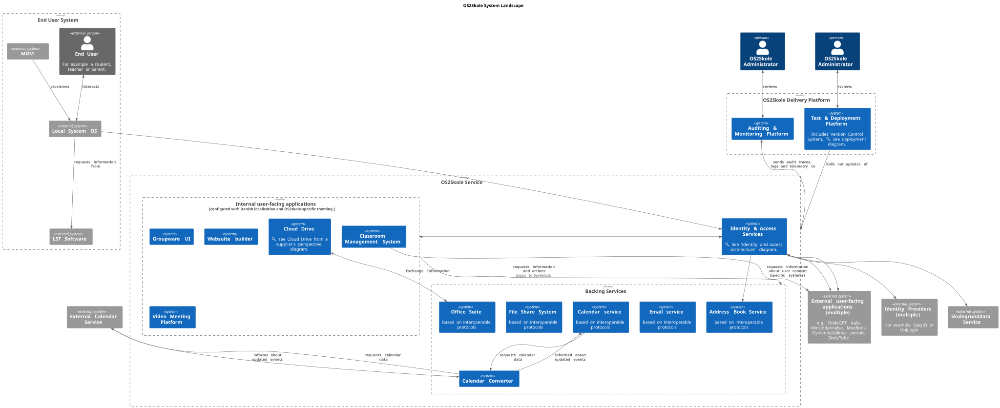

# C4 System Landscape Diagram

This diagram provides a high-level overview of the system components.

## Context
**Date:** Dec 17, 2025, **Author:** [@0xf1e](https://github.com/0xf1e)  
**Discussion Participants:** Input from [@janhalen](https://github.com/janhalen), https://github.com/OS2sandbox/os2skole-PoC/pull/46

**Originally intended Audience and Purpose:**  

* Our own team: "We want to see all system components on one diagram, so that we can better assess risks and the project's feasibility."
* Potential technology partners: "We want to see where our own work and skills can fit into the OS2Skole project."

## Implied Decisions

(todo) 
